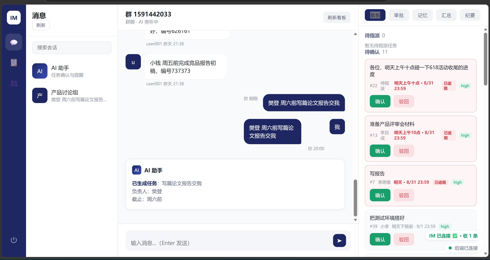
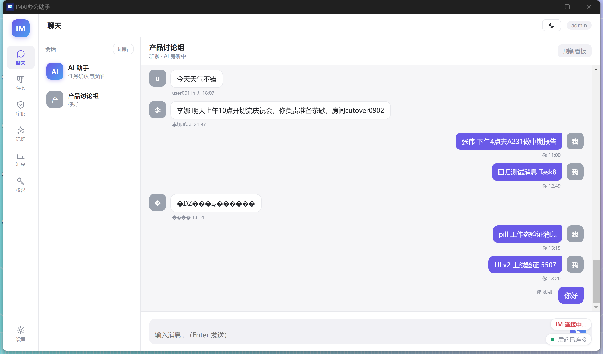

<div align="center">

# IMAI 办公助手 · 对话即工作台，AI 即员工


**[中文](#imai-办公助手--对话即工作台ai-即员工-1) · [English](#what-is-imai)**

</div>

---

## 中文版

### 我们是啥

**IMAI 是一个对话式 AI 办公助手**：它像一个 AI"数字员工"一样待在你的工作群里——旁听大家聊天，谁说了要干什么活，它记下来、找说话人确认、进看板、到点提醒。人只负责拍板，跟单的事它包了。

它解决小团队最日常的痛点：**群里聊得好好的事情，说完就散了**。口头安排没有归属、没有截止、没人跟进，全靠人肉记忆和责任心。

```
群里有人说"小李 周五前把报表发了" → AI 识别出这是任务
   ├─ 负责人明确 → 弹出确认卡（不打断对话）
   ├─ 有歧义（三个"小张"）→ AI 私聊说话人确认指谁
   └─ 无人认领 → 每天下班前汇总提醒管理员
确认后 → 任务进看板 @负责人 → 到期自动提醒（24h 前 / 当天 / 逾期）
负责人点「完成」或群里说"做完了" → 看板同步
AI 全程留痕，关键动作必须人审
```

| 群聊 AI 旁听 → 任务确认卡 → 看板 | Electron 桌面端 |
|---|---|
|  |  |

**核心能力**：群消息 AI 任务识别 · 歧义私聊消歧（三个"小张"指谁？）· 看板与逾期标红 · 三档到期提醒 · 完成闭环（按钮 + 口头"做完了"）· 团队记忆（术语/称谓注入识别）· RBAC 权限与全程审计。

**适合谁**：10–50 人、没有专职项目经理的项目型团队；不想上重型 OA 但"口头承诺没人跟"天天发生的创业公司；需要本地部署、数据不出域的团队。

### 技术栈

| 层 | 选型 |
|---|---|
| 桌面端 | **Electron**（托盘 / 系统通知 / 开机自启 / 后端生命周期管理） |
| 后端 | **TypeScript · Hono · Zod**（单体，Hono RPC 类型化契约） |
| 数据层 | **Drizzle ORM + PostgreSQL**（唯一数据库，迁移管理 schema） |
| 聊天层 | **自建**（消息落库幂等 + SSE 实时推送 + 离线拉历史） |
| AI | **OpenAI 兼容接口**（默认 DeepSeek，Zod 结构化输出 + 验证重试，可切本地模型） |
| 前端 | **原生 TypeScript + esbuild**（无框架） |
| 认证 | scrypt 口令哈希 + session token（per-user） |

特点：单机本地部署，**零 Docker / 零 Python / 零 Rust 工具链**，数据不出域。

### 架构

```
Electron 壳（托盘未读 · 系统通知 · 开机自启 · 后端子进程生命周期）
   │  HTTP (127.0.0.1:8000) + SSE 实时事件
Hono/TS 后端单体
   ├── 聊天层（消息落库幂等 → SSE fanout → 离线拉历史）
   ├── AI 管线（意图识别 → 归属判定 → 确认卡 → 提醒 → 记忆）
   └── 任务/看板/纪要/RBAC/统计
   │  Drizzle ORM（迁移管理 schema）
PostgreSQL（业务 + 聊天，唯一数据库）
```

三条设计底线：**AI 不擅自执行**（确认/驳回人审兜底）、**消息不丢不重**（唯一约束幂等 + 双去重键 + 断线全量刷新兜底）、**数据不出域**（全在自己数据库里）。

### 参与贡献

- 🗺️ [ROADMAP](ROADMAP.md) — 看看接下来做什么，欢迎 Issue 讨论 priority
- 🤝 [CONTRIBUTING](.github/CONTRIBUTING.md) — 开发环境搭建、Spec 先行约定与 PR 流程
- 🐞 [提 Issue](https://github.com/ConradLu2740/im-ai-office/issues/new/choose) — Bug 报告与功能建议模板

### License

本项目采用 [PolyForm Noncommercial 1.0.0](LICENSE) 协议开源：

- ✅ **个人学习、内部办公、研究等非商业用途**：自由使用、修改、分发（需保留原协议与版权声明）
- ❌ **商业用途**（将本项目或其修改版用于商业产品、对外销售、商业服务等）：需获得作者商业授权，联系本仓库所有者洽谈

---

## English Version

### What is IMAI?

**IMAI is a conversational AI office assistant** that lives in your work group chat like an AI "digital employee" — it listens to the conversation, captures commitments ("Xiao Li, send the report by Friday"), asks the sender to confirm, tracks them on a kanban board, and sends due-date reminders. Humans make the calls; it does the follow-up.

It solves the most common small-team pain point: **things discussed in chat evaporate the moment the conversation moves on**. Verbal assignments have no owner, no deadline, no follow-up — it all relies on memory and goodwill.

```
Someone says "Xiao Li, send the report by Friday" → AI recognizes a task
   ├─ Assignee clear  → confirmation card pops up (without interrupting the chat)
   ├─ Ambiguous       → AI DMs the sender privately ("which 'Zhang' did you mean?")
   └─ Unclaimed       → daily digest reminds the admin before end of day
Confirmed → task lands on the kanban, assignee notified → due-date reminders kick in
Assignee clicks "done" or says "done!" in chat → board syncs
Every AI action is audited; critical actions require human approval
```

| AI task extraction → confirmation → kanban | Electron desktop app |
|---|---|
|  |  |

**Key capabilities:** AI task extraction from group messages · ambiguity resolution via AI DM · kanban with overdue alerts · tiered reminders (24h / due-day / overdue) · completion loop (button or natural-language "done!") · team memory (terms & nicknames injected into recognition) · RBAC with full audit trail.

**Ideal for:** project-based teams of 10–50 without a dedicated PM; startups tired of verbal commitments nobody tracks; privacy-sensitive teams that need self-hosted deployment.

### Tech Stack

| Layer | Choice |
|---|---|
| Desktop | **Electron** (tray / system notifications / auto-start / backend lifecycle) |
| Backend | **TypeScript · Hono · Zod** (single monolith, Hono RPC typed contracts) |
| Data | **Drizzle ORM + PostgreSQL** (single database, migration-managed schema) |
| Chat | **Built-in** (idempotent message persistence + SSE push + offline history) |
| AI | **OpenAI-compatible API** (DeepSeek by default, Zod structured output with validation retry, local models supported) |
| Frontend | **Vanilla TypeScript + esbuild** (no framework) |
| Auth | scrypt password hashing + session tokens (per-user) |

Single-machine self-hosted deployment: **no Docker / no Python / no Rust toolchain**, data never leaves your server.

### Architecture

```
Electron shell (tray unread badge · notifications · auto-start · backend lifecycle)
   │  HTTP (127.0.0.1:8000) + SSE real-time events
Hono/TS backend monolith
   ├── Chat layer (idempotent persistence → SSE fanout → offline history)
   ├── AI pipeline (intent detection → assignment → confirmation cards → reminders → memory)
   └── Tasks / kanban / minutes / RBAC / stats
   │  Drizzle ORM (migration-managed schema)
PostgreSQL (business + chat, single database)
```

Three design principles: **AI never acts on its own** (confirmation / rejection always human-approved), **no message lost or duplicated** (unique-constraint idempotency + dual dedup keys + full refresh on reconnect), **data stays in-house** (everything in your own database).

### Get Involved

- 🗺️ [ROADMAP](ROADMAP.md) — see what's next; Issues welcome
- 🤝 [CONTRIBUTING](.github/CONTRIBUTING.md) — dev setup, spec-first workflow, PR guide
- 🐞 [Open an issue](https://github.com/ConradLu2740/im-ai-office/issues/new/choose)

### License

This project is open-sourced under the [PolyForm Noncommercial 1.0.0](LICENSE) license:

- ✅ **Personal learning, internal office use, research, and other noncommercial purposes**: free to use, modify, and distribute (keep the original license and copyright notice)
- ❌ **Commercial use** (using this project or a derivative in a commercial product, paid service, etc.): requires a commercial license from the repository owner
